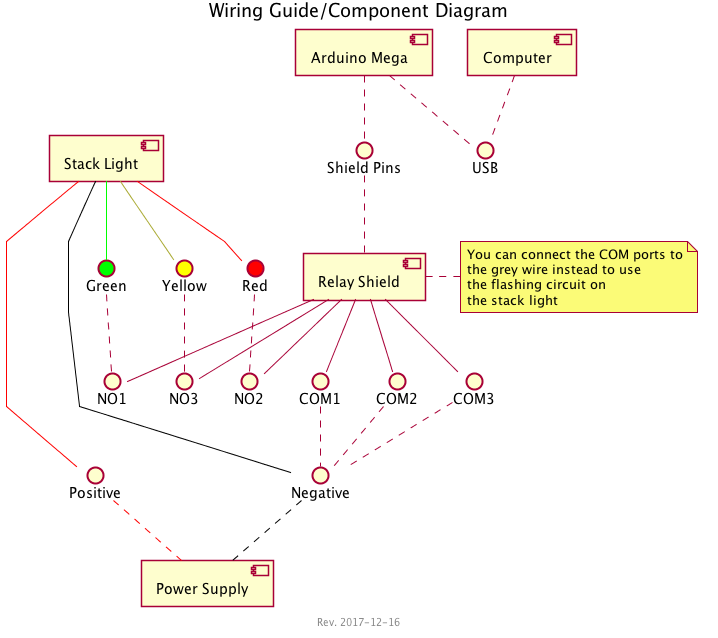

# Relay Stack Light

Control a stack light via serial communications through an Arduino! To get this project setup and running will require minimal knowledge for wiring up an Arduino (and shield) to a light fixture.

## Hardware Requirements

This project uses the following hardware to operate:

- [Arduino Mega 2560 rev3](https://store.arduino.cc/usa/arduino-mega-2560-rev3)
- [Relay Shield v3](https://www.seeedstudio.com/Relay-Shield-v3.0-p-2440.html)
- [3 Bulb Stack Light](https://www.amazon.com/dp/B00AFXJKNA)
- [24v 1a AC/DC Power Supply](https://www.amazon.com/gp/product/B00NUI2WGY)

## Usage

### Setup

You can use the following diagram to guide you in wiring everything together:

It's worth noting that although the relay shield has 4 relays, we are only using 3 since the stack light we are using only has 3 lights (red, green, yellow). We do not use the fourth relay, but it can still be controlled in commands sent.

### Interacting

Right now you can only communicate to the Arudino via serial communication. You can use the following to assist in this:

- `screen /dev/cu.usbmodel3111 19200`
- Using the Serial Monitor in the Arduino IDE or VS Code extension

The Arudino software is set to run at 19200 baud. If you are seeing malformed/odd characters then make sure you have set the correct baud rate.

### Commands

Each command will return the final relay status, which can be parsed as needed.

|Command|Description|Example|
|---|---|---|
|`?`|Print commands available|`?`
|`!`|Print relay status (on or off)|`!`|
|`+ [relayNumber]`|Turn on a single relay or all relays (if not defined)|`+ 1`|
|`- [relayNumber]`|Turn off a single relay or all relays (if not defined)|`- 1`|
|`/`|Toggle a single relay or all relays (if not defined)|`/ 1`|
|`: [relayNumber] [iterationCount=1] [onTime=500] [offTime=500] [dwellTime=0]`|Flash one or all relays at once|`: ? 3 500 500 500`|
|`~ [iterationCount=1] [onTime=200] [offTime=0] [dwellTime=0]`|Flash each relay in order|`~ 3 500 500 500`|
|`%`|Run demo mode|`%`|

## Contributing

It's much easier to use VS Code or another text editor/IDE instead of the very basic/limiting Arudino IDE.

### Setup VSCode

1. Install [Arudino IDE]([https://www.arduino.cc/en/main/software#download]) for all system packages
1. Add the [Arduino extension](https://marketplace.visualstudio.com/items?itemName=vsciot-vscode.vscode-arduino) to VSCode (`vsciot-vscode.vscode-arduino`)
1. Add the [EditorConfig extension](https://marketplace.visualstudio.com/items?itemName=EditorConfig.EditorConfig) to VS Code (`EditorConfig.EditorConfig`)

## Roadmap

- [x] Arudino to interface Relay shield to serial communications
- [ ] Code documentation
- [ ] Javascript wrapper library to assist with interfacing to Arudino via serial
- [ ] Expand Javascript library to connect to various application monitoring services
